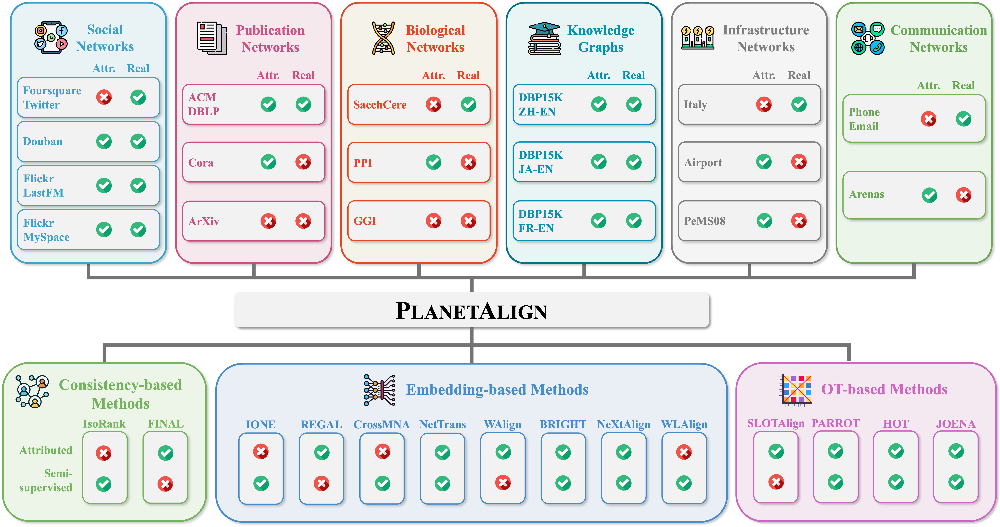
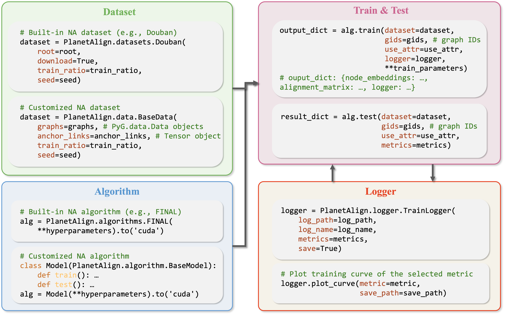

<div align="center">

</div>

<div align="center">
    <a href="https://arxiv.org/pdf/2505.21366">
    </a>
    <a href="https://planetalign.readthedocs.io/en/latest/"></a>
    <a href="https://github.com/yq-leo/PlanetAlign/blob/main/LICENSE.txt"></a>
    <a href="https://github.com/yq-leo/PlanetAlign"></a>
</div>

# A comprehensive Python library for Network Alignment

PlanetAlign is a comprehensive Python library for network alignment (NA), featuring a rich collection of built-in datasets, methods, and evaluation pipelines with efficient and easy-to-use APIs.

---

## 🚀 Features

- 📊 **Built-in benchmark datasets** spanning social networks, publication networks, communication networks, biological networks, infrastructure networks, and knowledge graphs.
- 🧠 **Pre-implemented NA algorithms** across consistency, embedding and OT-based NA methods.

<div align="center">

</div>

- 🛠️ **Easy-to-extend architecture** for custom datasets and models.
- 📈 **Standardized evaluation metrics**: Hits@K, MRR, Runtime, Memory Usage, etc.
- 🧪 **Experiment utilities** for scalability, robustness, and sensitivity analysis.

<div align="center">

</div>

---

## 📦 Installation

Download repo from https://github.com/yq-leo/PlanetAlign, then run

```bash
cd PlanetAlign
pip install -e .
```

---

## 📃 Documentation & Tutorial

For detailed documentations and a quick-start tutorial, please see https://planetalign.readthedocs.io/en/latest/

---

## 📜 Citation
``` bibtex
@article{yu2025planetalign,
  title={PLANETALIGN: A Comprehensive Python Library for Benchmarking Network Alignment},
  author={Yu, Qi and Zeng, Zhichen and Yan, Yuchen and Liu, Zhining and Jing, Baoyu and Qiu, Ruizhong and Azad, Ariful and Tong, Hanghang},
  journal={arXiv preprint arXiv:2505.21366},
  year={2025}
}
```
